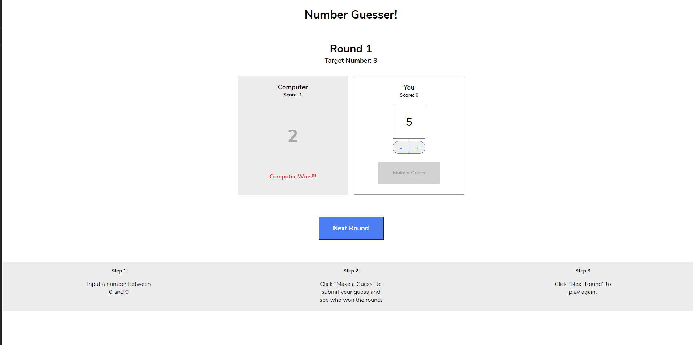

  

# NumberGuesser

## Description
 ---
 
 For this project i used a javascript back-end structure to make a random number guessing game.
## Install 
---

 Any Basic Web Browser(Internet Explorer, Chrome etc.) will be able to run this application 
## Contributing 
---

 No rules for contribution. I got the base of this code as a project from Codecademy.
## Usage 
---

 Sometimes you are bored and need a little game. 
## Tests
---

 I did not run any tests. 
## License 
---

 MIT License license(s) 
## Questions 
---

  if you have any questions feel free to reach out to me at [My Github](https://github.com/tylerdahl123) or feel free to email me at [My Email](dahlgren15@gmail.com) 
